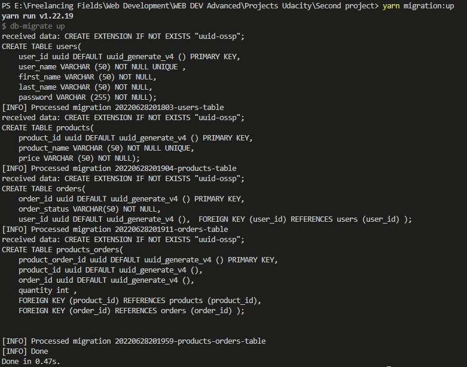

# Project: Build A Storefront Backend

This is a backend API build in Nodejs for an online store.
It exposes a RESTful API that will be used by the frontend developer on the frontend.
To lead to a full front and backend STORE.

The database schema and and API route information in the pictures in the last of readme

## Installation Instructions

This section contains all the packages used in this project and how to install them.
or, you can use this repo and run the following command at the root directory to install all packages.

`yarn` or `npm install`

### Packages

Here are some of packages that were installed.

#### express

`npm i express`
`npm i --save-dev @types/express`

#### typescript

`npm i --save-dev typescript`

#### db-migrate

`npm install -g db-migrate`

#### rimraf

`npm install --save rimraf`

#### bcrypt

`npm i bcrypt`
`npm i --save-dev @types/bcrypt`

#### morgan

`npm install --save morgan`
`npm i --save-dev @types/morgan`

#### jsonwebtoken

`npm install jsonwebtoken `
`npm i --save-dev @types/jsonwebtoken`

#### dot-env

`npm install dotenv --save`

#### jasmine

`npm install jasmine @types/jasmine ts-node --save-dev`

#### supertest

`npm i supertest`
`npm i --save-dev @types/supertest`

## Set up Database

### Create Databases

We should create the dev and test database.

- connect to the default postgres database as the server's root user `psql -U postgres`
- In psql run the following to create a user
  - `CREATE USER postgres WITH PASSWORD 'moh@medXl0lX';`
- In psql run the following to create the dev and test database
  - `CREATE DATABASE store_dev;`
  - `CREATE DATABASE store_test;`
- Connect to the databases and grant all privileges
  - `\c store_dev`
  - `\c store_test`

### Migrate Database

Navigate to the root directory and run the command below to migrate the database

`yarn migration:up`

## Enviromental Variables Set up

Bellow are the environmental variables that needs to be set in a `.env` file. This is the default setting that I used for development, but you can change it to what works for you.

port = 3000 //this is the server port that's running on
nodeEnv= dev //this is the env of the db
pgHost= localhost  
pgPort=5432 //default port that i'm working at (DB CONNECTION)
pgDb=store_dev //this is the development DB that is the default
pgDb_test=store_test //this is the testing DB that is only at testing
pgUser=postgres //this is the default user os postgress
pgPassword=moh@medXl0lX //this is my password for main postgress you can change it
saltRound= 10 //this is the default salt rounf for json web token
pepperHash=my-secret-password //this is just any plain text to be the default pepper
tokenSecret=my-secret-token //this is secret token to be add while using JWT to gurantee the token

## Start App

`yarn dev` or `npm run dev`

### Running Ports

After start up, the server will start on port `3000` and the database on port `5432`

## Endpoint Access

All endpoints are described in the [REQUIREMENT.md](REQUIREMENTS.md) file.

## Token and Authentication

Tokens are passed along with the http header as

`"Authorization " "Bearer <token>"`

## Testing

Run test with

`yarn migration:test` or `npm run migration:test`

It sets the environment to `test`, migrates up tables for the test database, then running jasmine on the all test cases ,
after that we make reset for all test database tables .

### Changing Enviroment to testing

I had set up two databases, one for development and the other for testing. During testing, I had to make sure the testing database is used instead of the developement database.

To acheive this, I set up a variable in the `.env` file which is by default set to `dev`. During testing, the command `yarn migration:test` will set this variable to `test` in the package.json. Here is the complete command.
`set nodeEnv=test && db-migrate --env test up && npx tsc && jasmine && db-migrate --env test reset `

The first command changes the enviroment variable `ENV` to `test` then the second command migrates all tables, then the jasmine is run and then after testing, the database is reset.
